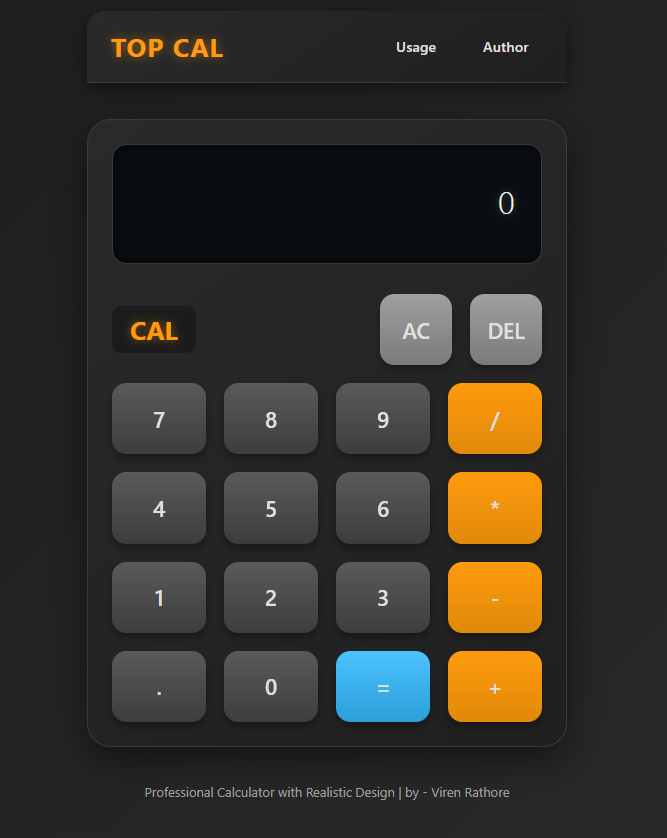

# Calculator 🔢

A simple, responsive calculator built using **HTML**, **CSS**, and **JavaScript** as part of [The Odin Project](https://www.theodinproject.com/) curriculum.

## ✨ Features

- Basic arithmetic operations: addition, subtraction, multiplication, division
- Responsive UI
- Keyboard support (optional)
- Styled layout using modern CSS

## 📷 Screenshot



## 🚀 How to Run

Just open `index.html` in your browser:

```bash
firefox index.html
# or
google-chrome index.html
